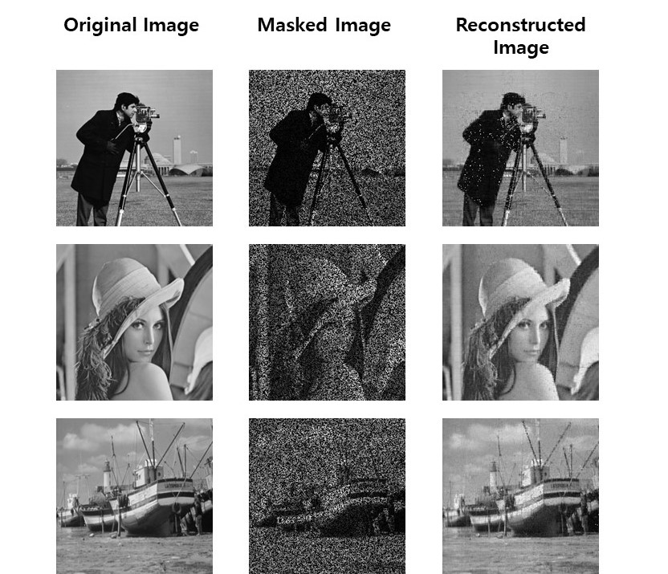

# matrix-completion
Python Implementation of the paper 'A Singular Value Thresholding Algorithm for Matrix Completion(SIAM Journal on  optimization 2010)'

### Requirements
* Python, Scipy, PIL, numpy, matplotlib

### Details
* The goal is reconstructing the given scribbled image.
* For given image, make a scribbled image by using random mask.
* Using matrix completion(SVT), reconstruct the original image.

### Results
* Approx. 50s for 1000 iterations

### References
[1] Cai, Jian-Feng, Emmanuel J. Candès, and Zuowei Shen. "A singular value thresholding algorithm for matrix completion." SIAM Journal on optimization 20.4 (2010): 1956-1982.
